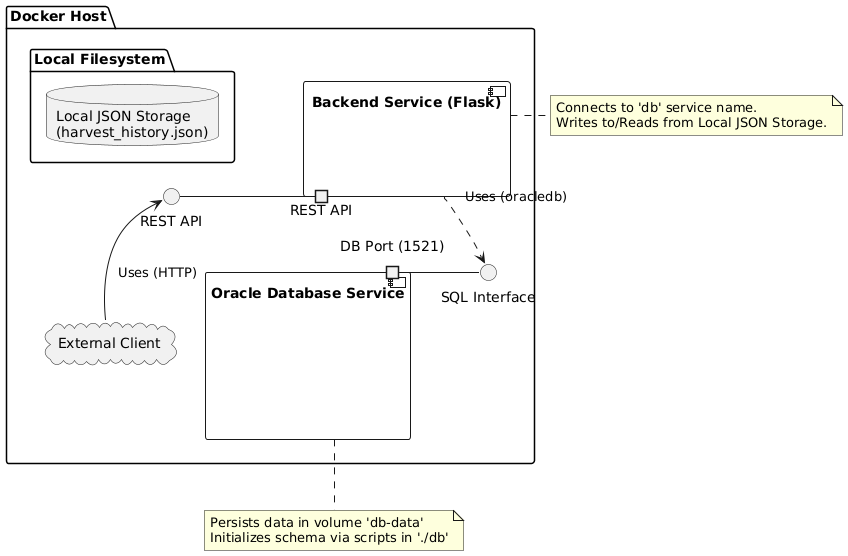
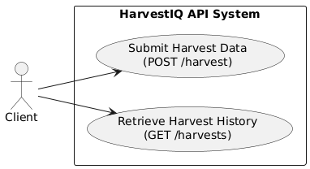
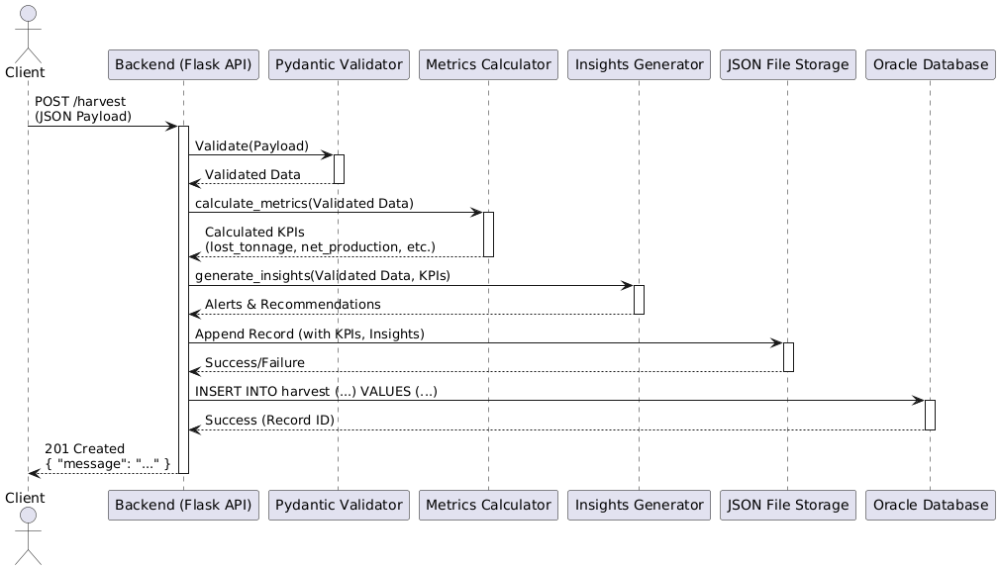
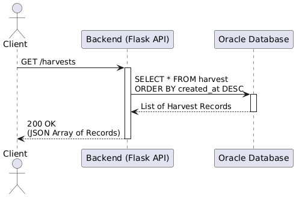

# HarvestIQ: Sugarcane Harvest Optimization

## Overview

HarvestIQ is an API‑driven solution designed to **optimize sugarcane harvest operations** by quantifying losses, calculating efficiency metrics, and delivering actionable insights. Built with Python and Docker, it provides a clear, data‑driven workflow that:

- Receives detailed harvest data via a RESTful POST endpoint.
- Validates and processes inputs using Pydantic models and modular functions.
- Persists records both locally (JSON) and in an Oracle database.
- Computes key performance indicators (KPIs) and generates alerts/recommendations.
- Exposes a GET endpoint for retrieving historical harvest records.

This project addresses the complexity of agribusiness data management—specifically the “pain point” of high sugarcane harvest losses—by leveraging automation, structured data handling, and containerization.

---

## Architecture & Docker

This solution uses **Docker Compose** to orchestrate two services defined in the root `docker-compose.yaml`:

```yaml
services:
  db:
    image: gvenzl/oracle-free
    container_name: oracle-db
    expose:
      - 1521
    environment:
      ORACLE_PASSWORD: "Oracle123"
    volumes:
      - db-data:/opt/oracle/oradata # Persist database files
      - ./db:/container-entrypoint-initdb.d # Initialization scripts
    healthcheck:
      test:
        [
          "CMD-SHELL",
          "echo 'SELECT 1 FROM DUAL;' | sqlplus -S system/$$ORACLE_PASSWORD@//localhost:1521/FREEPDB1",
        ]
      interval: 10s
      timeout: 10s
      retries: 5
      start_period: 60s

  backend:
    container_name: backend
    build: ./backend # Dockerfile in backend/
    command: python /app/app.py # Launch Flask server
    volumes:
      - ./backend:/app # Mount code for live reload
    ports:
      - "8000:8000" # Expose Flask on host port 8000
    environment:
      ORACLE_HOST: "db"
      ORACLE_PORT: "1521"
      ORACLE_SERVICE_NAME: "FREEPDB1"
      ORACLE_USER: "harvest_user"
      ORACLE_PASSWORD: "harvest_pass"
    depends_on:
      db:
        condition: service_healthy

volumes:
  db-data:
```

**Component Diagram:**

<p align="center">
  
</p>

### Behind the Scenes

1. **Oracle DB Container** (`gvenzl/oracle-free`):

   - **Data persistence**: uses `db-data` volume under `/opt/oracle/oradata`.
   - **Init scripts**: automatically runs `01_create_harvest_table.sql` from `./db`, which:
     - Switches session to pluggable database `FREEPDB1`.
     - Creates the `harvest_user` schema and grants privileges.
     - Creates the `harvest` table for storing records.
   - **Healthcheck**: polls `SELECT 1` every 10 seconds, up to 5 retries, with a 60-second startup delay.

2. **Backend Container** (`python:3.12-slim` with custom Dockerfile):

   - **Build**: installs Python dependencies from `requirements.txt` and copies application code into `/app`.
   - **Live code mounting**: maps local `./backend` to `/app` for immediate code changes.
   - **Startup**: waits for the DB to become healthy, then runs `python /app/app.py` on port 8000.
   - **Configuration**: reads Oracle connection settings (host, port, service name, credentials) from Compose environment entries.
   - **Operation**: hosts the Flask API, connecting to the Oracle database and serving requests.

No external `.env` file is required—**all configurations** are declared directly in `docker-compose.yaml`.

---

## Getting Started

### Prerequisites

- **Docker** and **Docker Compose** installed.
- **Git** to clone the repository.

### Setup & Run

1. Clone the repository:
   ```bash
   git clone https://github.com/your-org/HarvestIQ.git
   cd HarvestIQ
   ```
2. Launch the Docker stack:
   ```bash
   docker-compose up --build
   ```
3. Verify both services are running:
   - `oracle-db` will initialize the database and run healthchecks.
   - `backend` will build and start the Flask server on `localhost:8000`.

After a minute:

- **POST** to `http://localhost:8000/harvest` to add records.
- **GET** from `http://localhost:8000/harvests` to retrieve history.

---

## API Endpoints

**Use Case Diagram:**

<p align="center">
  
</p>

### 1. POST `/harvest`

Registers a new harvest record.

**Sequence Diagram (POST /harvest):**

<p align="center">
  
</p>

**Request Body** (`application/json`):

```json
{
  "area": 150.0,
  "production": 1800.0,
  "loss_percentage": 12.0,
  "duration_hours": 7.5,
  "harvest_method": "mechanical",
  "moisture_percentage": 25.0,
  "harvest_date": "2025-04-17",
  "operator_id": "OP12345",
  "equipment_id": "EQ67890",
  "variety": "RB867515",
  "ambient_temperature": 38.0,
  "brix_percentage": 10.0
}
```

| Field                 | Type   | Description                             |
| --------------------- | ------ | --------------------------------------- |
| `area`                | Float  | Harvest area in hectares (must be > 0). |
| `production`          | Float  | Gross yield in tons (≥ 0).              |
| `loss_percentage`     | Float  | Estimated loss (%) [0–100].             |
| `duration_hours`      | Float  | Time spent (hours, > 0).                |
| `harvest_method`      | String | "manual" or "mechanical".               |
| `moisture_percentage` | Float  | Cane moisture (%) [0–100].              |
| `harvest_date`        | String | Date of harvest (YYYY‑MM‑DD).           |
| `operator_id`         | String | Identifier of the operator/team.        |
| `equipment_id`        | String | Identifier of the harvesting machine.   |
| `variety`             | String | Cane cultivar code.                     |
| `ambient_temperature` | Float  | Ambient temperature (°C).               |
| `brix_percentage`     | Float  | Sugar content (°Brix) [0–30].           |

**Response** (`201 Created`):

```json
{ "message": "Harvest created successfully" }
```

### 2. GET `/harvests`

Retrieves all harvest records, sorted by most recent.

**Sequence Diagram (GET /harvests):**

<p align="center">
  
</p>

**Response** (`200 OK`):

```json
[
  {
    "id": 1,
    "area": 150,
    "production": 1800,
    "loss_percentage": 12,
    "lost_tonnage": 216,
    "net_production": 1584,
    "productivity_per_hour": 211.2,
    "productivity_per_hectare": 10.56,
    "alert": "Losses exceed the expected threshold (10%). High moisture level for mechanical harvesting. Low °Brix (10.0): sugar yield may be sub‑optimal. High temp & moisture: risk of microbial spoilage.",
    "recommendation": "Check cutter bar pressure. Consider delaying harvest or using manual harvesting. Consider delaying harvest until Brix ≥ 12. Process cane quickly or lower moisture prior to storage.",
    "created_at": "2025-04-17T19:22:42"
  }
]
```

---

## Core Components & Subalgorithms

- **Models**: `HarvestPayload` (Pydantic) for strict input validation.
- `calculate_metrics`: computes loss tonnage, net yield, hourly & per‑ha productivity.
- `generate_advice`: aggregates rule‑based insights (loss thresholds, moisture, Brix, productivity, spoilage risk, operator/machine flags).
- **File I/O**: `harvest_history.json` for local audit trail.
- **Oracle Integration**: `connect_oracle` & `insert_record_oracle` using `oracledb` and Python‑generated timestamp (ZoneInfo).

---

## Project Requirements & Validation

This implementation fully satisfies initial requirements:

1. **Agribusiness Focus**: addresses sugarcane harvest loss optimization.
2. **Subalgorithms**: modular functions with parameter passing.
3. **Data Structures**: lists, dicts, JSON.
4. **File Manipulation**: read/write JSON.
5. **Database**: Oracle XE connection and persistence.
6. **Clear Logic**: linear flow from POST → processing → persistence → GET.
7. **Input Validation**: Pydantic enforces types and ranges.
8. **Documentation**: complete README with context, usage, and architecture.

All assignment criteria have been implemented and validated.

---

## License & Contribution

Contributions are welcome! Please open issues or submit PRs. Preserve the original submission version after the deadline to avoid grade penalties.

_© 2025 HarvestIQ Team_
